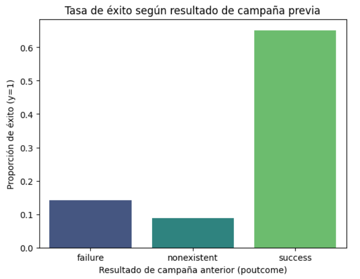
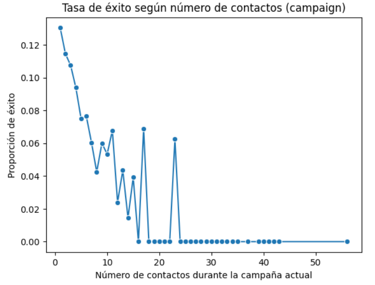
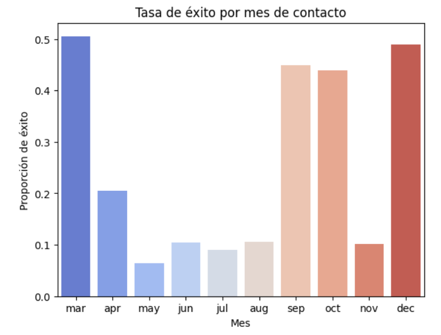
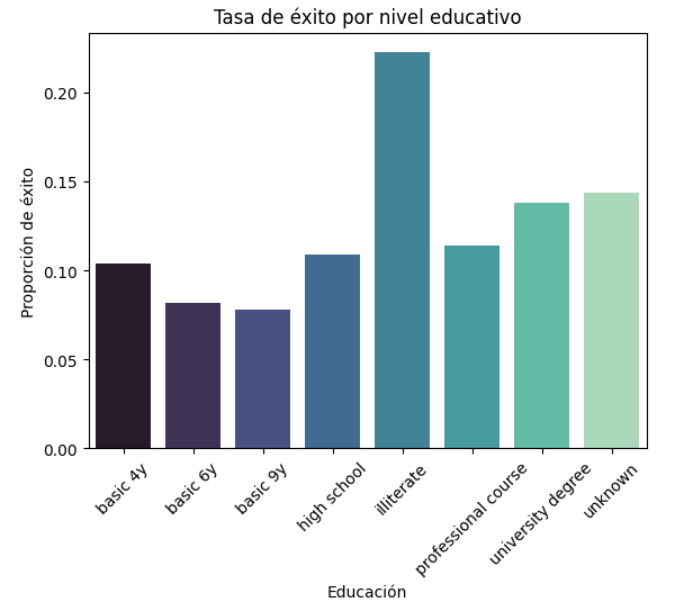
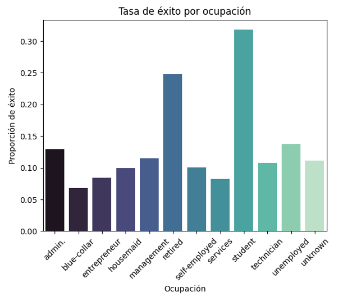
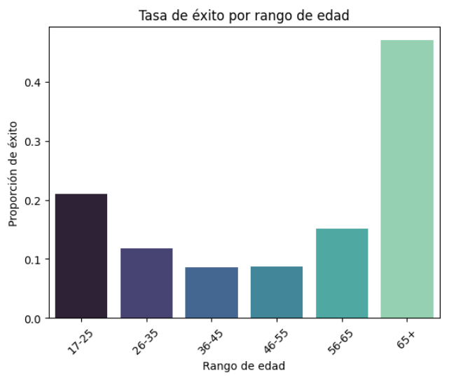
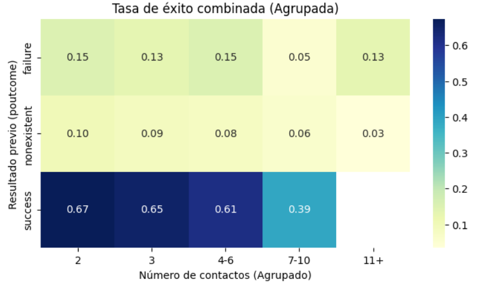
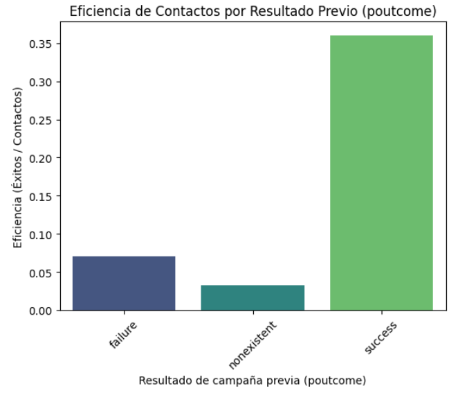
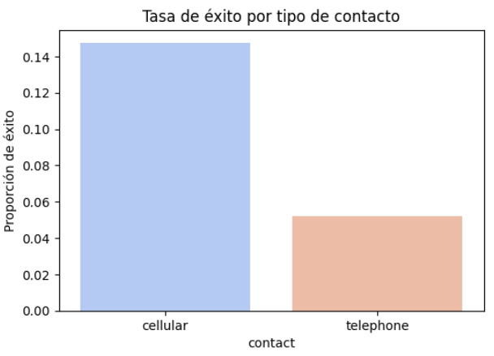
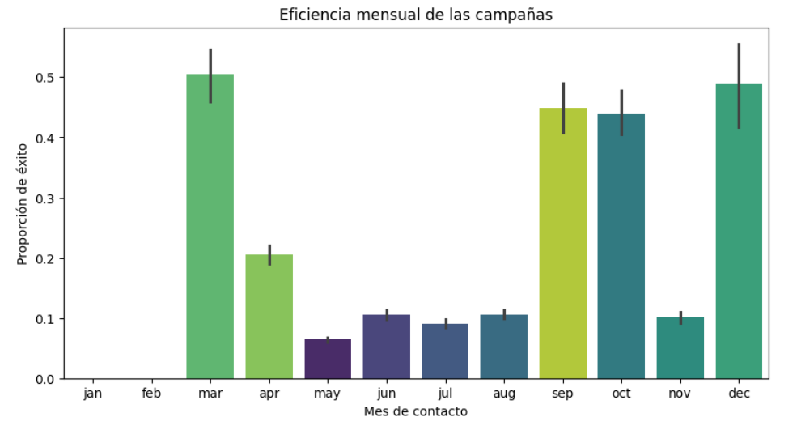

# 📚 Proyecto de Análisis de Datos: Eficiencia y Tiempos de Campaña 📚

## 📊 Eficiencia y Tiempos de Campaña
## 🧠 Descripción
Este proyecto tiene como objetivo analizar la **eficiencia y duración de las campañas** para identificar patrones de rendimiento y tiempos óptimos de ejecución.  
A través del uso de **Python** y librerías como **pandas**, **seaborn** y **matplotlib**, se busca comprender cómo los diferentes factores como la duración, el canal o el tipo de campaña influyen en los resultados obtenidos.
El enfoque principal es descubrir **qué campañas fueron más eficientes** y **en qué condiciones de tiempo alcanzaron los mejores resultados**.

## 🗂️ Diccionario de datos (Variables principales)
A continuación se describen brevemente las variables más relevantes utilizadas en el análisis:
| Columna | Descripción |
|--------|-------------|
| `y_bool` | Responde a la pregunta ¿El cliente ha contratado un depósito a plazo fijo? (binario: "sí", "no"). |
| `poutcome` | Resultado de la campaña de marketing anterior (categórico: "fracaso", "inexistente", "éxito")|
| `pdays_bool` | Número de días transcurridos desde el último contacto con el cliente en una campaña anterior (Variable tratada= 999 significa que no se ha contactado previamente con el cliente) |
| `age(imp:median)` | Edad de cliente imputada con la mediana. |
| `campaign` | número de contactos realizados durante esta campaña y para este cliente (numérico, incluye el último contacto) |
| `duration(imp:median)` | Duración del último contacto, en segundos (numérico). Nota importante: este atributo influye considerablemente en el resultado esperado (Si duration=0, entonces y="no") |
---

## 🧰 Herramientas Utilizadas

<table>
<tr>
<td align="center" width="25%">
<br>
<b>Python 3.x</b>
</td>
<td align="center" width="25%">
<br>
<b>Pandas</b><br>
<sub>Limpieza y manipulación de datos</sub>
</td>
<td align="center" width="25%">
<br>
<b>Seaborn</b><br>
<sub>Análisis visual de tendencias y correlaciones</sub>
</td>
<td align="center" width="25%">
<br>
<b>Matplotlib</b><br>
<sub>Gráficos personalizados</sub>
</td>
</tr>
<tr>
<td align="center" colspan="4">
<br>
<b>Jupyter Notebook</b><br>
<sub>Entorno de análisis interactivo</sub>
</td>
</tr>
</table>


## 🔍 Proceso de Análisis
### 1. Importación de datos desde archivo CSV. 
> ```python
> df= pd.read_csv("PFDA_bank_campaigns.csv", sep= ";")
> ```
---
### 2. Limpieza y tratamiento de valores faltantes o atípicos.
> ```python
># Limpieza de datos en la columna education
>df["education"]=df["education"].str.replace("."," ",regex=False)
> ```
✔️ Columnas con valores nulos
- `age`
- `job`
- `education`
- `duration`
✔️ Valores duplicados  
Se comprobó que no existen filas duplicadas.
✔️ Nulos explícitos  
Valores `"unknown"` en columnas categóricas como `job`, `education`, `contact`.  
---
### 3. Análisis exploratorio de datos (EDA) para identificar patrones. 
### 📌 Distribución de `campaign`
- Media aproximadamente **2.56 contactos**
- Alta desviación estándar  
- Outliers extremos (hasta 56 contactos)
### 📌 Análisis de `poutcome`
Categorías presentes:  
`success`, `failure`, `other`, `unknown`.
Los clientes con **poutcome = success** muestran mayor probabilidad de suscripción actual. Donde se busca visualizar y entender la relación entre el historial del cliente con campañas previas y su comportamiento en la campaña actual.

### 📌 Análisis de `campaign` y `y_bool`
Calcula y grafica la tasa promedio de éxito `y_bool` según el número exacto de contactos `campaign` que se realizaron con cada cliente durante la campaña actual.
Por lo que el número de contactos es un factor determinante en la efectividad de la campaña. El análisis demuestra que contactar pocas veces es más eficiente, mientras que aumentar la frecuencia reduce significativamente la probabilidad de éxito. 

### 📌 Análisis de `Month` y `y_bool`
Se desea obtner la proporción de éxito `y_bool` por cada mes en que se contactó al cliente. Permitiendo detectar patrones temporales, efectos estacionales y momentos óptimos para contactar clientes. Los meses de marzo, septiembre, octubre y diciembre presentan las tasas más altas de conversión, destacando marzo como el mes más efectivo con más del 50% de éxito. 


## 👤📝Análisis en columnas relacionadas al cliente
### 📌 Análisis de `education`
Se lo implementó para obtener la proporción real de personas que aceptaron la campaña en cada nivel educativo.
Las categorías como basic 4y, basic 6y o basic 9y normalmente muestran una proporción más baja de respuestas positivas, lo que sugiere menor interés, menor confianza o menor capacidad económica para tomar este tipo de decisión financiera.

### 📌 Análisis de `job`
La ocupación del cliente es un factor relevante para predecir el éxito de la campaña.
Los grupos como estudiantes, jubilados y desempleados muestran mayor probabilidad de conversión, mientras que aquellos con ocupaciones más demandantes tienden a rechazar más.

### 📌 Análisis de `age`
Se analiza cómo influye la edad en el éxito de la campaña y muestra qué grupos etarios son más receptivos.
Hay grupos que responden mucho mejor, especialmente los adultos mayores de 65 años. Esto sugiere que las estrategias de marketing pueden ser más efectivas si se enfocan en estos rangos, ajustando contenido y recursos para maximizar el impacto.

### 📈 Relación entre `poutcome`, `campaign` y `y` (suscripción)
Se busca entender la relación combinada entre el historial del cliente y la intensidad de contacto sobre el éxito.
Con el `pivot_table` se desea saber, qué tan probable es que un cliente diga "sí" dependiendo de su historial y del número de contactos hechos.
El análisis combinando `poutcome` y `campaign_grouped` revela que la efectividad de la campaña depende mucho del historial previo del cliente, siendo el grupo con resultado "success" el más propenso a aceptar nuevamente. Además, el número óptimo de contactos está entre 2 y 3, ya que un exceso de intentos disminuye la probabilidad de éxito en todos los segmentos. Por tanto, la estrategia recomendada es priorizar clientes con historial positivo y limitar el número de contactos para evitar pérdidas de eficiencia.
  

### 4. Visualización de la eficiencia y los tiempos de campaña.  
### ☎️ Métrica contact_efficiency = éxitos / contactos
Esto permite evaluar qué tan rentable fue volver a contactar a cada tipo de cliente según su historial.
Donde los clientes cuyo resultado previo fue "success" son altamente eficientes:
- Generan más conversiones
- Requieren menos esfuerzo de contacto
- Deberían ser prioridad en futuras estrategias
Los grupos "failure" o "nonexistent" son menos eficientes, especialmente "nonexistent", lo que indica que dirigir recursos hacia ellos tiene menor retorno.

### ⏱️ Eficiencia temporal por canal y mes
El tipo de contacto sí influye en la probabilidad de éxito, por lo que las campañas realizadas por contacto móvil (cellular) son claramente más efectivas, mientras que los contactos por línea fija generan menos resultados.


El análisis de la tasa de éxito por mes revela que el comportamiento de los clientes varía significativamente según la época del año, lo que indica que el momento del contacto influye directamente en la probabilidad de conversión.
En la mayoría de los casos, los meses marzo, abril, septiembre, octubre y diciembre suelen presentar mayores tasas de éxito, lo que sugiere que durante estas épocas los clientes están más receptivos a ofertas financieras.


### 5. Interpretación de resultados y generación de conclusiones.
- **Resultado de campañas previas (poutcome)**
Los clientes que tuvieron un resultado previo "success" muestran una mayor tasa de éxito y la mayor eficiencia de contacto. Esto confirma que el comportamiento pasado es un fuerte predictor del comportamiento futuro, por lo que este grupo debe ser priorizado en nuevas campañas.
- **Número de contactos en la campaña actual (campaign)**
La tasa de éxito disminuye a medida que aumentan los contactos, lo que indica que insistir demasiado no mejora los resultados. Contactos repetidos pueden generar rechazo o agotamiento del cliente, por lo que es importante optimizar el número de intentos.
- **Combinación entre "poutcome" y número de contactos (Heatmap)**
La eficiencia más alta se observa en clientes con poutcome=success y bajo número de contactos, reforzando la idea de que quienes ya mostraron interés requieren menos esfuerzo y generan conversiones más rápidas.
- **Mes de contacto (month)**
Se detectan meses con mayor receptividad (como marzo, abril, septiembre, octubre y diciembre) y meses menos efectivos (como mayo, junio y julio). Esto evidencia que la temporalidad influye directamente en la eficacia de la campaña, por lo que se recomienda planificar esfuerzos en meses estratégicos.
- **Nivel educativo (education)**
Ciertos niveles educativos presentan tasas de éxito más altas, lo que sugiere que el grado de formación puede influir en la comprensión del producto ofertado o en el interés financiero del cliente. Este hallazgo permite segmentar y dirigir mejor los mensajes.
- **Rango de edad**
Los adultos mayores a 65 años suelen ser los más receptivos a la campaña seguido del grupo de 17-25 años, mientras que los grupos de 36-45 años y 46-55 años muestran tasas menores. Esto indica que existe un segmento etario ideal para dirigir esfuerzos comerciales.
- **Ocupación del cliente (job)**
Las ocupaciones como estudiantes, jubilados y desempleados muestran mayores tasas de éxito, probablemente por una mayor disponibilidad de tiempo o interés en productos de ahorro. En cambio, roles como blue collar, entrepreneurs y services muestran menor receptividad, lo que sugiere que sus perfiles son más exigentes o menos accesibles.
- **Tipo de contacto (cellular vs telephone)**
Las llamadas a celulares tienen una tasa de éxito considerablemente mayor. Esto sugiere que el canal de comunicación es determinante y que las campañas futuras deberían priorizar métodos más efectivos.
- **Eficiencia global de contactos**
Al relacionar éxitos obtenidos y cantidad de contactos, se confirma que contactar a clientes con historial positivo maximiza la eficiencia. Los grupos sin información previa ("nonexistent") son los menos eficientes, por lo que representan un mayor costo-operativo con menor retorno.

# 🛠️ Recomendaciones y Soluciones
### ✔️ 1. Limitar contactos por cliente  
Máximo de **3 intentos** para evitar rechazo y pérdida de eficiencia.
### ✔️ 2. Priorizar clientes con historial exitoso  
Segmento con mayor conversión inmediata.
### ✔️ 3. Rediseñar estrategias para clientes "nonexistent"  
Utilizar scripts diferenciados o mensajes previos.
### ✔️ 4. Descartar contactos excesivos (>10)  
Transferirlos a flujos automatizados o no intrusivos.
### ✔️ 5. Optimizar el momento de contacto  
Basado en análisis por trimestre.
### ✔️ 6. No usar `duration` como predictor  
Solo debe emplearse para análisis descriptivo.

## ✒️ Autores
- **Bollorino Montoya Favio** 
- **Velasquez Rogel Joel** 
- **Villacís Morán Cristina** 
- **Vinueza Gutiérrez Allison** 
📅 Proyecto elaborado en **noviembre de 2025**  
💻 Coding Bootcamps Espol:*Data-Driven Specialist*
---